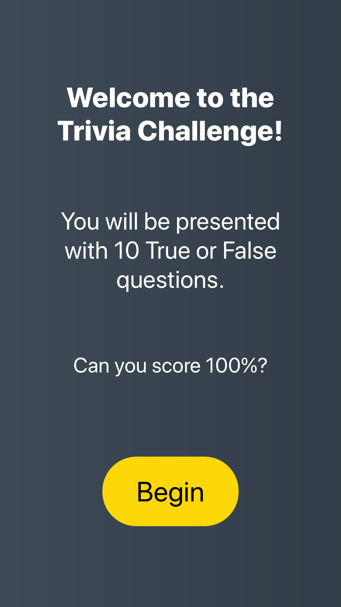
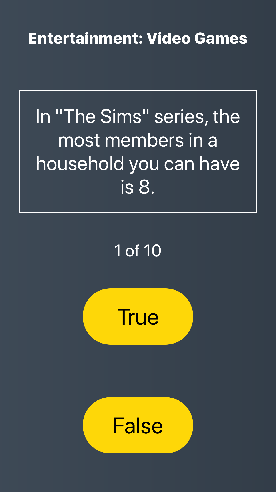
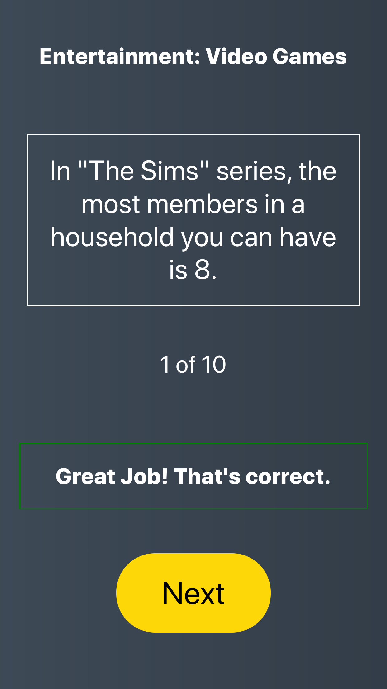
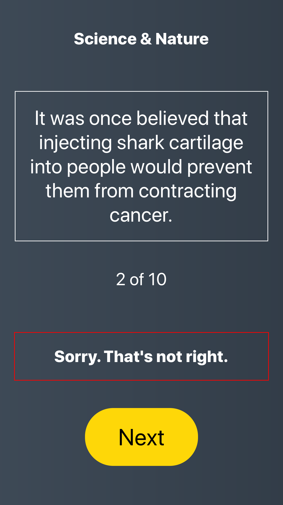
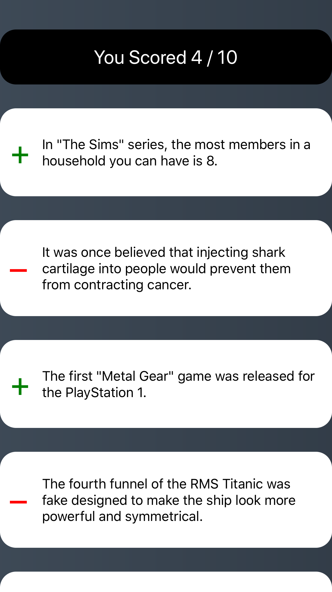
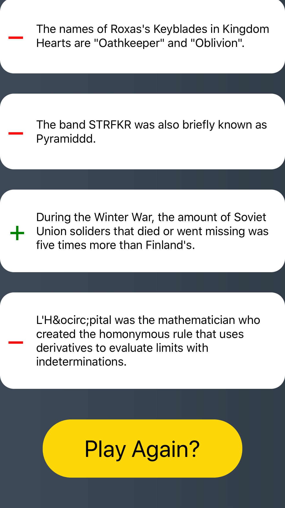
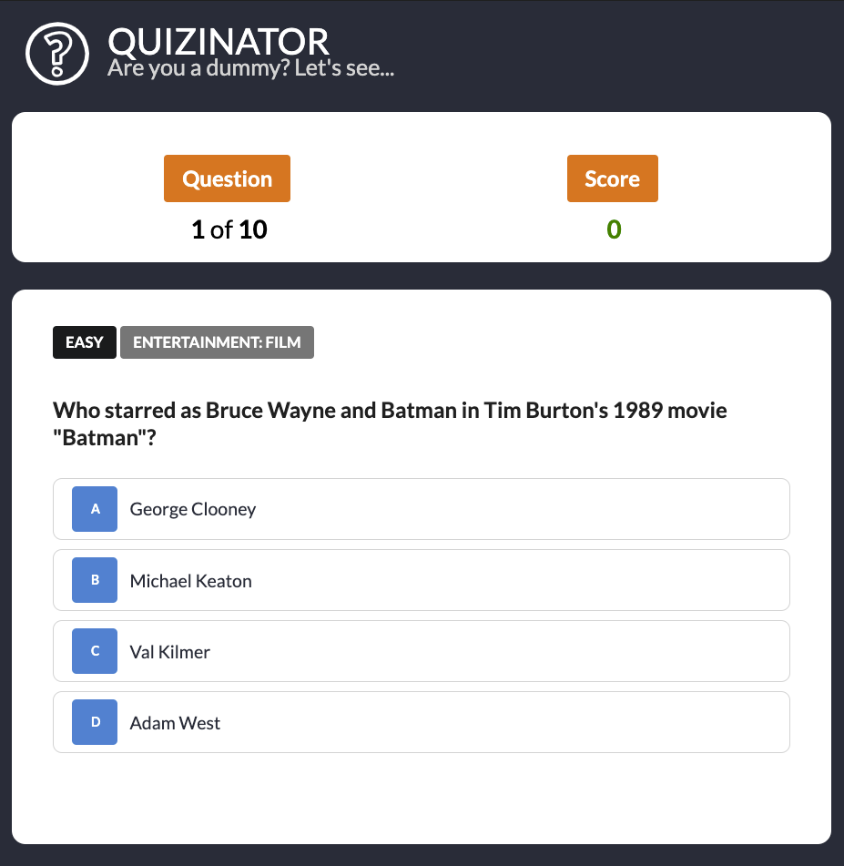

# (React Native + Redux) Quiz Game - GIF Demo 

# Intro Screen

# Question Screen

# Feedback: True

# Feedback: False

# Results Screen

# ScrollView, Repeat the game with new questions!

# Also used my responsive styling component
=> [react-native-cross-platform-responsive-dimensions](https://github.com/drumnation/react-native-cross-platform-responsive-dimensions)

# (React.js) Trivia Game using OpenTrivia API
## Completed in August 2017 for PureWow

## Play Quizinator (Hosted on Heroku)

### Click Here => [PLAY LIVE DEMO](https://protected-beyond-32253.herokuapp.com/)

### Assignment:
1. Create an online quiz component that can be placed on a web page. 

2. You may utilize any Javascript Framework you would like (or you can write it in Vanilla JS as well, but that would obviously take longer). Bonus points for using React.

3. Make sure the quiz receives its initialization data in JSON format. 

4. The quiz should deliver a grade to the user at the end, but it is not necessary to save the users score. 

5. Feel free to utilize any open source frameworks or plugins in addition to the Javascript Framework chosen above.

6. Send your code to ******* in any format you wish.  Make sure it is obvious how to run your code.

7. This is a programming position and not a design role, so you do not have to spend a lot of time making it look fancy.  Opt for function or over aesthetics.

8. Again, have fun!  The rest is up to you.